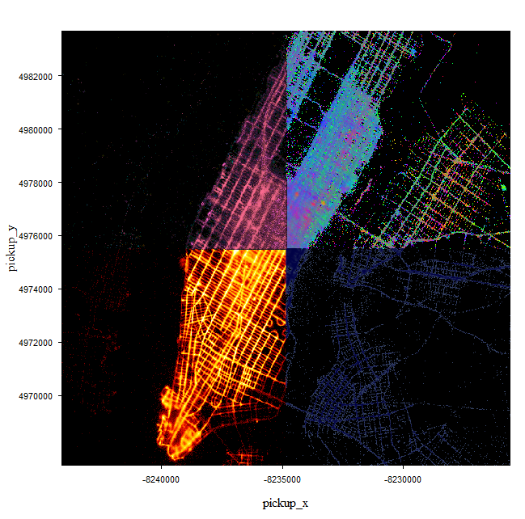
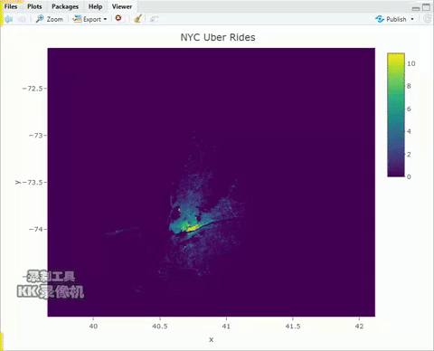
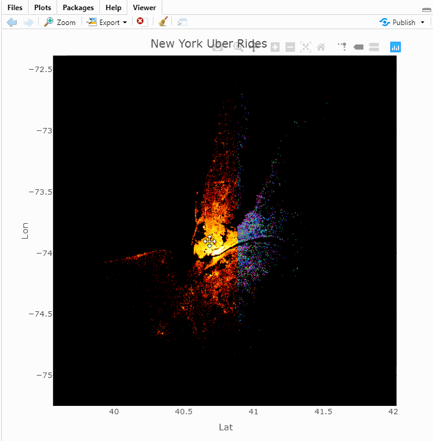

# Rasterizer
Display million data in seconds in R

## Load large data in R
`rasterizer` is a R package to display large data set (million or billion) in seconds. 
Here are a couple of ways to load large data in R with package `data.table` (https://cran.r-project.org/web/packages/data.table/vignettes/datatable-intro.html).

* csv file:
```
library(data.table)
data <- data.table::fread("yourpath/somefile.csv") # or a link
```

* parquet file:
Parquet files can provide efficient data compression to save much more space. Package `reticulate` (https://rstudio.github.io/reticulate/) offers "pandas" library (from Python) in R, which can help load parquet files.
```
library(data.table)
library(reticulate)
library(magrittr)
pandas <- reticulate::import("pandas")
read_parquet <- function(path, columns = NULL) {
  if (!is.null(columns)) columns <- as.list(columns)
  path.expand(path) %>% 
      normalizePath() %>%
      pandas$read_parquet(., columns = columns) %>%
      data.table::as.data.table(., stringsAsFactors = FALSE)
}
data <- read_parquet("yourpath/somefile.parquet")
```
Note, make sure `NumPy` and `Pandas` are installed with latest version.

## Install

`rasterizer` can be installed directly from github

```
remotes::install_github("https://github.com/plotly/rasterizer")
```

## Use `rasterizer` to display large data set

`rasterizer` is built based on `datashader` http://datashader.org/getting_started/index.html in python. Both are designed by "rasterizing" large data set into images. In computation, `datashader` is faster so far but `rasterizer` is comparable; in usage, `rasterizer` provides more readable and flexible operation interface. 

Each `rasterizer` object is composed of three part: `rasterizer()`, `rasterize_...()`(like `rasterize_points()`, ...) and `execute()`. `rasterizer()` is used for initial setting rasterizer (image width, image height, ...) and other information passed through layers (if they are not specified in layers); `aggregation_...()`s are layers to be added; after piping `rasterizer()` and `aggregation_...()`s, code will not be fired until we call `execute()`.

```
data %>%
  rasterizer() %>% 
  rasterize_points() %>% 
  execute() -> p
```

Note that, "p" contains image raster and other useful info (like numeric aggregation matrix) to produce image but it does **not** provide any graphs. Package `rasterizer` replies on the third parties to display like package `grid` and `ggplot` for static graphs or `plotly` and `loon` for interactive graphs.

#### Static graph

* `grid`
```
p %>%
  grid.rasterizer() # built based on `grid::grid.raster()`
```


* `ggplot`
```
ggplot(data, mapping) + 
  geom_rasterizer() # not yet finished, coming soon!
```

#### Interactive graph

* `plotly`
```
plot_ly(data, x, y) %>%
 add_rasterizer()
```


or

```
# Note that it may be deprecated in the future.
p %>% 
  plotly.rasterizer()
```


* `loon`
```
l_rasterizer(data, x, y) # not yet finished, coming soon!
```
Some apps can be found in https://github.com/plotly/rasterizer/tree/master/apps/